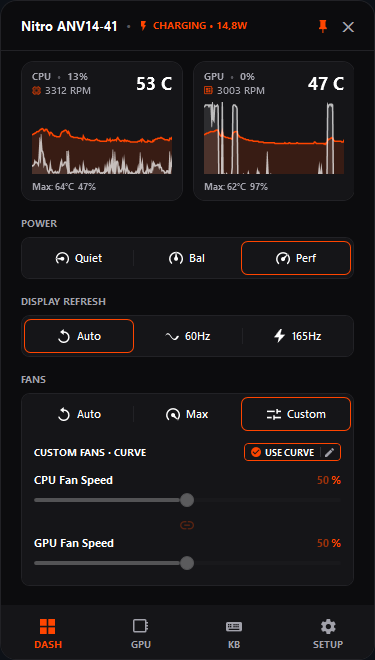
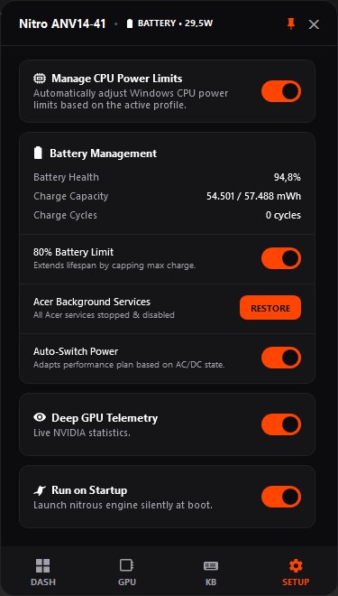

# Nitrous

**Lightweight, zero-bloat hardware control utility for Acer Nitro laptops.**

  
  
  

---

Nitrous interacts directly with your laptop's Embedded Controller (EC) via Windows Management Instrumentation (WMI), eliminating the need for heavy OEM background services. It provides an ultra-fast dashboard, comprehensive tray controls, and low resource overhead.

### Features

- **Interactive Fan Curve Editor:** Create custom CPU and GPU fan curves per power profile with waypoint grid snapping, hysteresis anti-revving delays, and direct hardware EC application.
- **Manual and Preset Fan Modes:** Instantly toggle between Auto, Max, Fixed Manual Percentage, or Dynamic Curve modes.
- **Quick-Access Tray Menu:** Control power profiles and fan modes, check for updates, or monitor temperatures directly from the Windows taskbar tray without opening the full dashboard.
- **Dynamic Power Modes:** Fast switching between Quiet, Balanced, Performance, and Turbo TDP modes.
- **GPU Overclocking and Underclocking:** Tune core and memory clock offsets with auto-apply profile support and hardware safety bounds.
- **Display Refresh Rate Automation:** Automatically switch to 60Hz on DC battery power and restore maximum panel refresh rate on AC power, with manual overrides.
- **Battery Health Control:** Hardware-level 80% charge threshold to prolong battery longevity.
- **Ultra-Low Resource Footprint:** Split-process transient UI architecture and optimized WMI polling keep idle background memory around 8-15 MB RAM.
- **dGPU Sleep Preservation:** Back-off polling logic prevents NVIDIA discrete graphics from waking up unnecessarily on battery.
- **Silent Windows Startup:** Starts automatically at boot without Windows UAC prompts using Windows Task Scheduler.
- **Built-in GitHub Auto-Updater:** Checks and applies new releases seamlessly.

### Quick Start

Nitrous is portable and requires no installation.

1. Download `Nitrous.exe` from [Releases](https://github.com/AtvouzX/nitrous_fork/releases).
2. Place the executable in a directory of your choice (e.g., `C:\Tools\Nitrous`).
3. Run `Nitrous.exe`.

The application minimizes to the System Tray. Click the tray icon, right-click for the quick menu, or press the dedicated Nitro keyboard key to bring up the dashboard.

### Compatibility

Designed for modern Acer Nitro laptops (2021+) supporting the `AcerGamingFunction` WMI interface.

**Tested Models:**
- Acer Nitro 16S (`AN16S-61`)
- Acer Nitro V 15 (`ANV15-41`, `ANV15-51`)

---

*Disclaimer: Unofficial open-source utility. Not affiliated with Acer Inc. Use at your own risk.*
