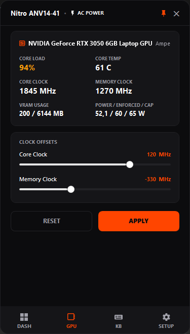

# Nitrous

**Lightweight, zero-bloat hardware control utility for Acer Nitro laptops.**

  
  
  

---

Nitrous interacts directly with your laptop's Embedded Controller (EC) via Windows Management Instrumentation (WMI), eliminating the need for heavy OEM background services. It provides an ultra-fast dashboard, comprehensive tray controls, and low resource overhead.

### Features

- **Fan Curve Editor & Controls**: Custom waypoint fan curves per power profile with anti-revving hysteresis, plus Auto, Max, and Custom modes.
- **Power Modes**: Fast EC switching across Quiet, Balanced, Performance, and Turbo profiles.
- **Acer Service Debloater**: One-click disable and restore for background OEM telemetry and updater services.
- **Battery & Display Automation**: Hardware 80% charge limit and automatic refresh rate switching on AC/DC.
- **GPU Tuning**: Core and memory clock offset controls with hardware safety limits.
- **Zero-Bloat Footprint**: ~8–15 MB idle RAM with dGPU sleep preservation on battery.

### Quick Start

Nitrous is portable and requires no installation.

1. Download `Nitrous.exe` from [Releases](https://github.com/AtvouzX/nitrous_fork/releases).
2. Place the executable in a directory of your choice (e.g., `C:\Tools\Nitrous`).
3. Run `Nitrous.exe`.

The application minimizes to the System Tray. Click the tray icon, right-click for the quick menu, or press the dedicated Nitro keyboard key to bring up the dashboard.

### Compatibility

Designed for modern Acer Nitro laptops (2021+) supporting the `AcerGamingFunction` WMI interface.

**Tested Models:**
- Acer Nitro 16S (`AN16S-61`)
- Acer Nitro V 15 (`ANV15-41`, `ANV15-51`)

---

*Disclaimer: Unofficial open-source utility. Not affiliated with Acer Inc. Use at your own risk.*
